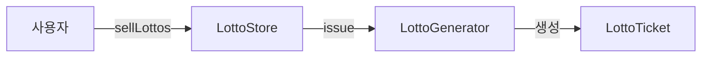
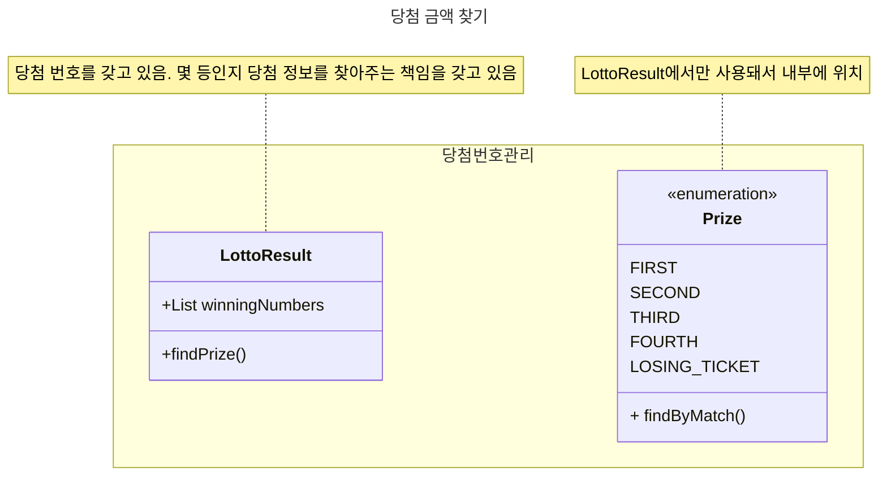

# 1단계 - 로또 자동 구매

## 기능 요구사항

- 로또 구입 금액을 입력하면 구입 금액에 해당하는 로또를 발급해야 한다.
- 로또 1장의 가격은 1000원이다.

## 새로운 프로그래밍 요구사항

- 배열 대신 컬렉션을 사용한다.
- 줄여 쓰지 않는다(축약 금지).
- 함수(또는 메서드)의 길이가 10라인을 넘어가지 않도록 구현한다.
- 함수(또는 메서드)가 한 가지 일만 하도록 최대한 작게 만들어라.

## 내가 생각한 객체 설계



### 흐름

1. 사용자는 LottoStore 객체에게 sellLottos 메세지를 보내 로또 티켓을 구매 요청을 한다.
2. LottoStore는 LottoGenerator (현재는 자동 발급)에게 issue 메시지를 보내 발급을 요청한다.
3. LottoGenerator는 자동 발급 방식을 통해 LottoTicket을 생성 후 반환한다.
4. 사용자는 LottoStore로부터 최종적으로 List<LottoTicket> 만 받게 된다.

각 개체들끼리는 내부에선 무엇을 하는지 신경 안 쓰도록 해보며, 최대한 메시지로만 생각해서 보내보도록 해보았다.

# 2단계 - 로또 당첨

## 기능 요구사항

- 로또 당첨 번호를 받아 일치한 번호 수에 따라 당첨 결과를 보여준다.
- 실행 결과

위 요구사항에 따라 14000원 어치 로또를 구매하였을 경우 프로그램을 실행한 결과는 다음과 같다.

## 새로운 프로그래밍 요구사항

- 모든 원시 값과 문자열을 포장한다.
- 일급 컬렉션을 쓴다.

## 내가 생각한 객체 설계

- 당첨 번호를 가진 LottoResult 객체. 몇 등인지 당첨 정보를 찾아주는 책임을 갖고 있음
    - findPrize를 통해 lottoTicket의 있는 숫자와 자신의 당첨 번호로 Prize를 찾아 준다.



# 3단계 - 로또 2등 당첨

## 기능 요구사항

- 2등을 위한 보너스볼을 추첨한다.
- 당첨 통계에 2등을 추가한다.
- 2등 당첨 조건은 당첨 번호 5개 일치 + 보너스 볼 일치다.

### 실행 결과

위 요구사항에 따라 14000원 어치 로또를 구매하였을 경우 프로그램을 실행한 결과는 다음과 같다.

```text
구입금액을 입력해 주세요.
14000

14개를 구매했습니다.
[8, 21, 23, 41, 42, 43]
[3, 5, 11, 16, 32, 38]
[7, 11, 16, 35, 36, 44]
[1, 8, 11, 31, 41, 42]
[13, 14, 16, 38, 42, 45]
[7, 11, 30, 40, 42, 43]
[2, 13, 22, 32, 38, 45]
[23, 25, 33, 36, 39, 41]
[1, 3, 5, 14, 22, 45]
[5, 9, 38, 41, 43, 44]
[2, 8, 9, 18, 19, 21]
[13, 14, 18, 21, 23, 35]
[17, 21, 29, 37, 42, 45]
[3, 8, 27, 30, 35, 44]

지난 주 당첨 번호를 입력해 주세요.
1, 2, 3, 4, 5, 6

보너스 볼을 입력해 주세요.
7
```

당첨 통계
---------
3개 일치 (5000원)- 1개
4개 일치 (50000원)- 0개
5개 일치 (1500000원)- 0개
5개 일치, 보너스 볼 일치(30000000원) - 0개
6개 일치 (2000000000원)- 0개
총 수익률은 0.35입니다.(기준이 1이기 때문에 결과적으로 손해라는 의미임)

## 새로운 프로그래밍 요구사항

- Java Enum을 적용한다.
