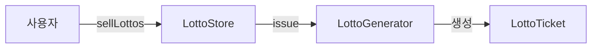

# 1단계 - 로또 자동 구매

## 기능 요구사항

- 로또 구입 금액을 입력하면 구입 금액에 해당하는 로또를 발급해야 한다.
- 로또 1장의 가격은 1000원이다.

## 새로운 프로그래밍 요구사항

- 배열 대신 컬렉션을 사용한다.
- 줄여 쓰지 않는다(축약 금지).
- 함수(또는 메서드)의 길이가 10라인을 넘어가지 않도록 구현한다.
- 함수(또는 메서드)가 한 가지 일만 하도록 최대한 작게 만들어라.

## 내가 생각한 객체 설계

### 흐름

1. 사용자는 LottoStore 객체에게 sellLottos 메세지를 보내 로또 티켓을 구매 요청을 한다.
2. LottoStore는 LottoGenerator (현재는 자동 발급)에게 issue 메시지를 보내 발급을 요청한다.
3. LottoGenerator는 자동 발급 방식을 통해 LottoTicket을 생성 후 반환한다.
4. 사용자는 LottoStore로부터 최종적으로 List<LottoTicket> 만 받게 된다.

각 개체들끼리는 내부에선 무엇을 하는지 신경 안 쓰도록 해보며, 최대한 메시지로만 생각해서 보내보도록 해보았다.
